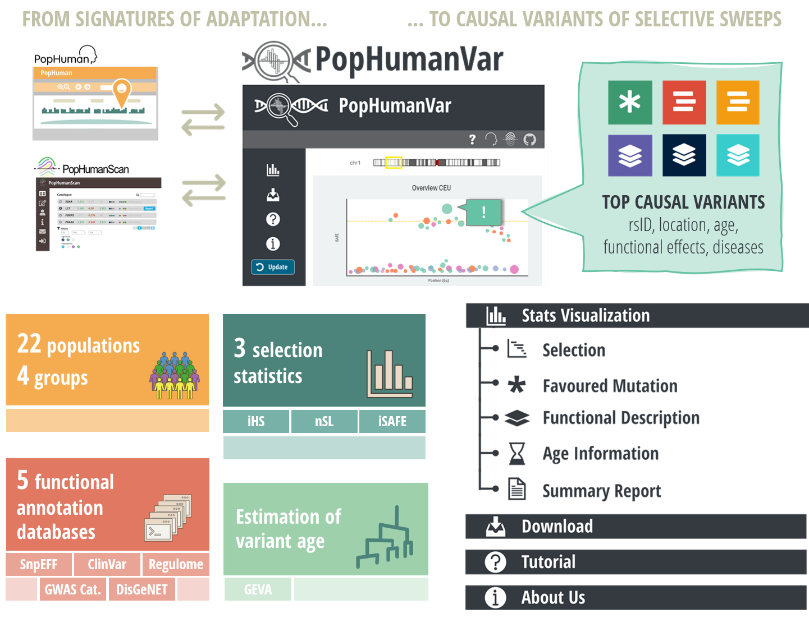
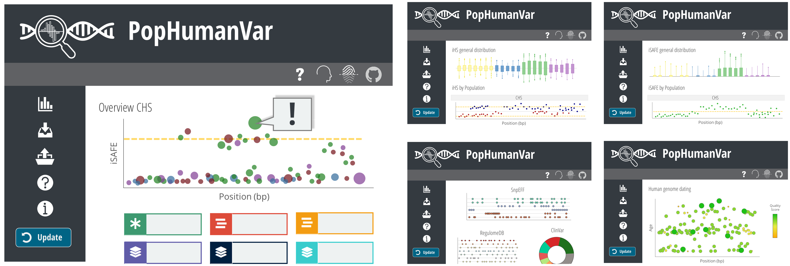

<!--
*** We have used the Best-README-Template to generate this README.
*** Go check their amaizing work! 
-->

<!-- PROJECT LOGO -->
 

  

<h1 align="center">PopHumanVar</h1>
  <h2 align="center">An interactive application for the functional characterization and prioritization of adaptive genomic variants in humans</h2>
  An online application that is designed to facilitate the exploration and thorough analysis of candidate genomic regions under selection, generating useful summary reports of prioritized variants that are putatively causal of recent selective sweeps. It compiles and graphically represents selection statistics based on linkage disequilibrium, a comprehensive set of functional annotations, and recent genealogical estimations of variant age for SNVs of the 26 populations of the phase 3 of the 1000GP. 
  

     
    <a href="https://github.com/ainacolovila/PopHumanVar"><strong>Explore the docs »</strong></a>
      
    <a href="https://pophumanvar.uab.cat/">Visit App</a>
    ·
    <a href="https://github.com/ainacolovila/PopHumanVar/issues">Report Bug</a>
    ·
    <a href="https://academic.oup.com/nar/advance-article/doi/10.1093/nar/gkab925/6401894">Check Article</a>
  

<!-- TABLE OF CONTENTS -->

  
Table of Contents

  <ol>
    <li><a href="#about-the-project">About The Project</a></li>
    <li><a href="#built-with">Built With</a></li>
    <li><a href="#tutorial">Tutorial</a></li>
    <li><a href="#documentation">Documentations</a></li>
    <li><a href="#copy-right">Copy Right</a></li>
    <li><a href="#author">Author</a></li>
    <li><a href="#cite-us">Cite Us</a></li>
    <li><a href="#acknowledgments">Acknowledgments</a></li>
    <li><a href="#contact">Contact</a></li>
    <li><a href="#refs">References</a></li>
  </ol>

 
 

<!-- ABOUT THE PROJECT -->
## About The Project
PopHumanVar is an interactive online application that is designed to facilitate the exploration and thorough analysis of candidate genomic regions under selection, generating useful summary reports of prioritized variants that are putatively causal of recent selective sweeps.
 
Available at: https://pophumanvar.uab.cat/
 
 

 

(<a href="#top">back to top</a>)

 

## Built With
PopHumanVar is based on the [Shiny](https://shiny.rstudio.com/) framework for development of web-based applications using the R programming environment. Interactive plots are implemented with plotly. Interactive tables are generated with DT, an R-based interface to the JavaScript DataTables library. The genome browser integrated into the Summary Report section is implemented using the JBrowseR package. User queries are processed by R and sent to a MariaDB database. 
PopHumanVar is served with Apache on a CentOS 7.2 Linux x64 server with 16 Intel Xeon 2.4 GHz processors and 32 GB RAM. All data, tools and support resources provided by the PopHumanVar database are open and freely available at https://pophumanvar.uab.cat. PopHumanVar is accessible and legible on computer, phone and tablet screens.
 

(<a href="#top">back to top</a>)

 

<!-- STRUCTURE -->
## Structure
The PopHumanVar interface is divided into four main sections: (i) Stats Visualization represents the main navigation interface and provides several interactive graphs to aid the exploration and prioritization of genomic variants in the region of interest (Figure 2); (ii) Download provides tools to customize batch downloads from the database; (iii) Upload Data allows uploading and analyzing a VCF file with custom data; and (iv) Tutorial describes the database and presents a step-by-step usage example.
 
 

 

(<a href="#top">back to top</a>)

 

<!-- TUTORIAL -->
## Tutorial
Check the [tutorial](https://pophumanvar.uab.cat/#tutorial). 
 

(<a href="#top">back to top</a>)

 

<!-- DOCUMENTATION -->
## Documentation
Check the app to blabla
- <b>scripts:</b> here you will find all scripts used to get the information displayed in PopHumanVar
    - cosa 1
    - cosa 2
    - cosa 3
    - cosa 4
- <b>README.md</b> this file (hi!)
- <b>.gitignore</b>
- <b>aboutUs_text.html</b>
- <b>intro_text.html</b>
- <b>tutorial_text.html</b>
- <b>helpSteps.csv</b>
- <b>global.R</b>
- <b>ui.R </b>
- <b>server.R</b>
- <b>www:</b> here are stored all the imatges used in PopHumanVar tutorial, as well as in the article
    - Fig_NN.png (from the tutorial)
    - PopHumanVar_NN.png (from the article)

See the [open issues](https://github.com/ainacolovila/PopHumanVar/issues) for a full list of proposed features (and known issues).
 

(<a href="#top">back to top</a>)

 

<!-- CITE US -->
## Cite Us
Please cite this reference for results obtained with PopHumanVar:

 Aina Colomer-Vilaplana, Jesús Murga-Moreno, Aleix Canalda-Baltrons, Clara Inserte, Daniel Soto, Marta Coronado-Zamora, Antonio Barbadilla, Sònia Casillas (2021) <strong>PopHumanVar: an interactive application for the functional characterization and prioritization of adaptive genomic variants in humans.</strong> <i>Nucleic Acids Research</i>, Advance access gkab925 (<a href="https://doi.org/10.1093/nar/gkab925" target="_blank">https://doi.org/10.1093/nar/gkab925</a>)
	
 

(<a href="#top">back to top</a>)

 

<!-- AUTHOR -->
## Authors

PopHumanVar was created at the Genetics and Microbiology Department and Institute of Biotechnology and Biomedicine of [Universitat Autònoma de Barcelona](https://www.uab.cat/) by [Aina Colomer i Vilaplana](https://portalrecerca.uab.cat/en/persons/aina-colomer-vilaplana) and [Jesús Murga Moreno](https://orcid.org/0000-0002-1812-0399), PhD Students.
 
 

(<a href="#top">back to top</a>)

 

<!-- COPY RIGHT -->
## Copy Right
 
<b>PopHumanVar</b> is licensed under the [GNU General Public License (GPL) v2.0](https://google.com). In a nutshell, this means that this package:

- May be used for commercial purposes
- May be used for private purposes
- May be modified, although:
    - Modifications **must** be released under the same license when distributing the package
    - Changes made to the code **must** be documented
- May be distributed, although:
    - Source code **must** be made available when the package is distributed
    - A copy of the license and copyright notice **must** be included.
- Comes with a LIMITATION of liability
- Comes with NO warranty
 

(<a href="#top">back to top</a>)

 

<!-- ACKNOWLEDGMENTS -->
## Acknowledgments
The authors would like to thank the [Port d’Informació Científica (PIC)](https://www.pic.es/)  of the UAB for providing the informatics infrastructure in which most of the population genomics statistics have been computed, and help on using it. We also thank Esteve Sanz for providing some data management utilities, Laia Carrillo for evaluating the PopHumanVar data on several case regions, and members of the Genomics, Bioinformatics and Evolutionary Biology group for testing the database implementation. Finally, we thank two anonymous referees for very helpful comments on the PopHumanVar implementation and manuscript.
 

(<a href="#top">back to top</a>)

 

<!-- CONTACT -->
## Contact
### Correspondence
<dl>
  <dt>Aina Colomer i Vilaplana</dt>
  <dd><b>Email: </b><a href="mailto:aina.colomer@uab.cat">aina.colomer@uab.cat</a></dd>
  <dt>Sònia Casillas</dt>
  <dd><b>Email: </b><a href="mailto:sonia.casillas@uab.cat">sonia.casillas@uab.cat</a> · <b>Tel: </b>+34 93 581 2730</a> · <b>Fax: </b>+34 93 581 2011</a></dd>
</dl>
 

### Mailing adress
<dl>
  <dt><strong><a href="https://gbbe.uab.cat/bgd/" target="_blank">Bioinformatics for Genomics Diversity group</a></strong></dt>
  <dd><strong>Department of Genetics and Microbiology</strong> · Universitat Autònoma de Barcelona, 08193 Bellaterra, Barcelona Spain
</dd>
  <dd><strong>Institut de Biotecnologia i de Biomedicina</strong> · Universitat Autònoma de Barcelona, 08193 Bellaterra, Barcelona Spain
</dd>
</dl>
 

(<a href="#top">back to top</a>)

 

<!-- REFS -->
## References
Check the app to blabla
 

(<a href="#top">back to top</a>)

 
 
